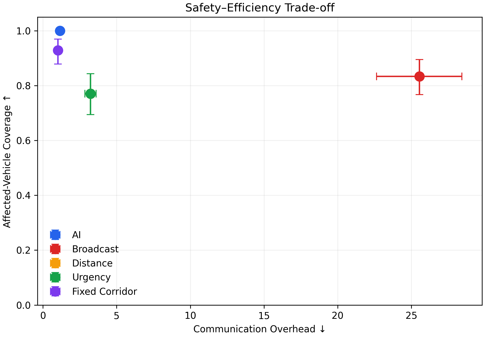

# Experimental Protocol and Preliminary Evidence

本文档定义当前课程演示所使用的实验口径。所有数值均来自锁定的 `directional-v2` 评价协议；它们是高速单事故场景下的初步证据，不代表真实道路或车规系统性能。

## 1. Evaluation question

The evaluation asks whether a learned, direction-constrained policy can preserve safety-relevant receiver coverage while reducing unnecessary transmissions and communication-resource cost. Every method consumes the same incident configuration, traffic state, and network seed before its result is recorded.

当前评价回答的是“同一仿真条件下，AI能否更精准地选择接收范围和资源”，而不是证明其已经能直接部署到真实车辆。

## 2. Locked protocol

| Item | Value |
|---|---|
| Protocol | `directional-v2` |
| Metric schema | v2 |
| Run mode | `demo_lite` |
| Road scope | Highway only |
| Incident configurations | 72 |
| Compared methods | 5 |
| Result rows | 360 |
| Coverage-eligible cases | 60 |
| Zero-affected cases | 12 |

The 12 zero-affected cases remain in the experiment matrix but are excluded from means for which coverage is mathematically undefined. Other metrics retain their own valid sample counts; therefore one global `n` must not be attached to every bar or mean.

覆盖率没有定义的样本不会被错误地记成0；各指标使用自己的有效样本数，这是答辩中解释统计口径时的重点。

## 3. Methods

| Method | Receiver selection | Priority and bandwidth |
|---|---|---|
| Broadcast | Every non-sender vehicle | Fixed high priority and full bandwidth |
| Distance | Vehicles within 300 m, independent of direction | Fixed high priority and full bandwidth |
| Urgency | Same 300 m candidate set as Distance | Severity-controlled priority and bandwidth |
| Fixed directional corridor | Vehicles in a fixed 300 m rear-risk corridor | Fixed high priority and 50% bandwidth |
| Transformer + PPO | Learned rear radius and lane scope | Learned priority and bandwidth fraction |

Distance and Urgency deliberately share the same receiver rule in this version. Their coverage and message-overhead values can therefore be equal, while latency and channel cost differ because Urgency changes resource allocation.

当前版本中“固定范围”和“紧急度”接收集合相同，区别主要在优先级与带宽；结果相近并非实现错误，而是基线定义的直接结果。

## 4. Metrics

Let \(A\) be the safety-relevant vehicle set, \(R\) the notified receiver set, and \(N\) the non-sender vehicle set.

\[
\mathrm{AffectedCoverage}=\frac{|A\cap R|}{|A|},\qquad |A|>0
\]

\[
\mathrm{MessageOverhead}=\frac{|R\setminus A|}{\max(1,|A|)}
\]

The network abstraction also reports effective delivery, latency percentiles, timeout rate, normalized channel cost, and timely-event rate. P95 latency is the 95th percentile of valid delivered-message latency, not a frame-rendering measurement.

## 5. Current held-out summary

| Method | Affected coverage | P95 latency | Message overhead | Channel cost |
|---|---:|---:|---:|---:|
| **Transformer + PPO** | **1.000** (`n=60`) | 35.52 ms (`n=61`) | 1.161 (`n=60`) | **0.321** (`n=60`) |
| Broadcast | 0.833 (`n=60`) | 52.70 ms (`n=72`) | 25.552 (`n=58`) | 25.552 (`n=58`) |
| Distance | 0.770 (`n=60`) | 33.66 ms (`n=70`) | 3.226 (`n=56`) | 3.226 (`n=56`) |
| Urgency | 0.770 (`n=60`) | 37.42 ms (`n=70`) | 3.226 (`n=56`) | 1.173 (`n=56`) |
| Fixed directional corridor | 0.929 (`n=60`) | **30.94 ms** (`n=60`) | **1.017** (`n=59`) | 0.508 (`n=59`) |

Interpretation must remain multi-objective: the learned policy has the highest affected-vehicle coverage and lowest channel cost in this artifact, while the fixed directional corridor has lower P95 latency and message overhead. The evidence supports a trade-off claim, not universal dominance.

结果支持“AI在覆盖和信道成本之间取得了更好的折中”，不支持“AI在所有指标上都最好”的表述。

## 6. Behavioral acceptance gate

The accepted model manifest records:

- 12 unique held-out incidents;
- 10 distinct receiver signatures;
- 4 distinct structured-action signatures;
- zero forward notifications;
- nearest-follower coverage of 1.0 across 6 eligible opportunities;
- a checkpoint hash matching the promoted manifest.

These checks prevent the presentation from silently using a constant template or an incompatible checkpoint. They do not replace broader generalization testing.

## 7. Limitations

- Highway-only, single-incident evidence;
- simulated traffic and a 3GPP-inspired network abstraction;
- no hardware-in-the-loop, field trial, or end-to-end cellular stack;
- limited event diversity and test size;
- no claim of publication-grade statistical power;
- current live UI compares AI with one selected baseline at a time, while offline evaluation covers all five methods.

The next research step is a preregistered multi-seed experiment spanning city roads, concurrent incidents, varied traffic density, and channel perturbations, with confidence intervals and significance tests generated from immutable result files.
