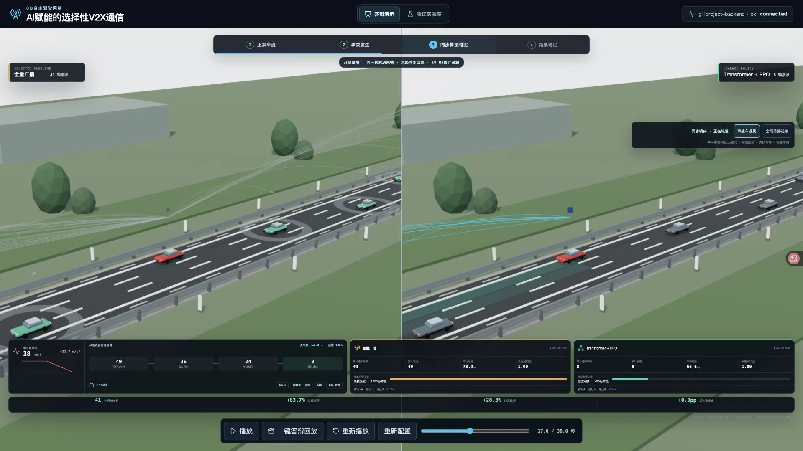
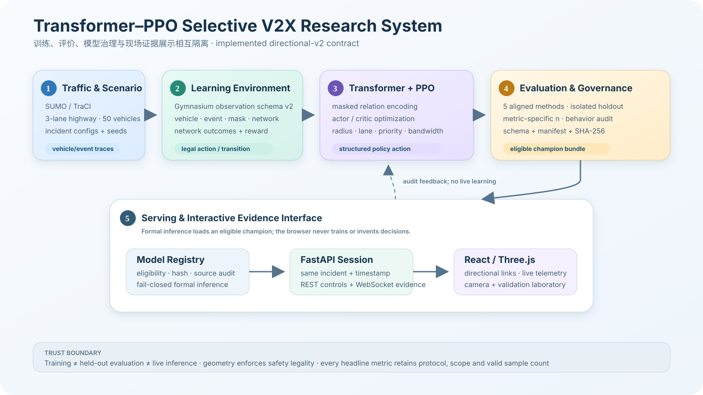
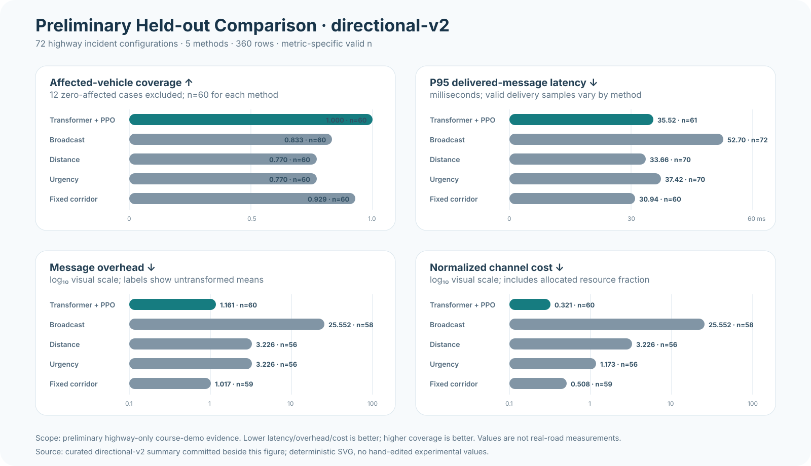
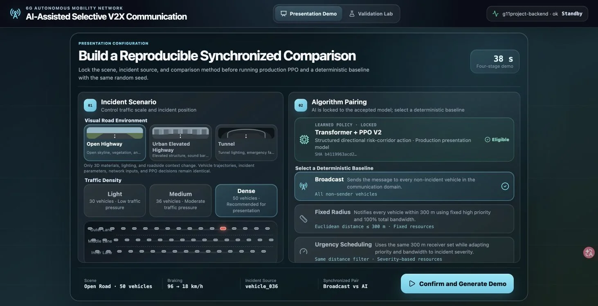
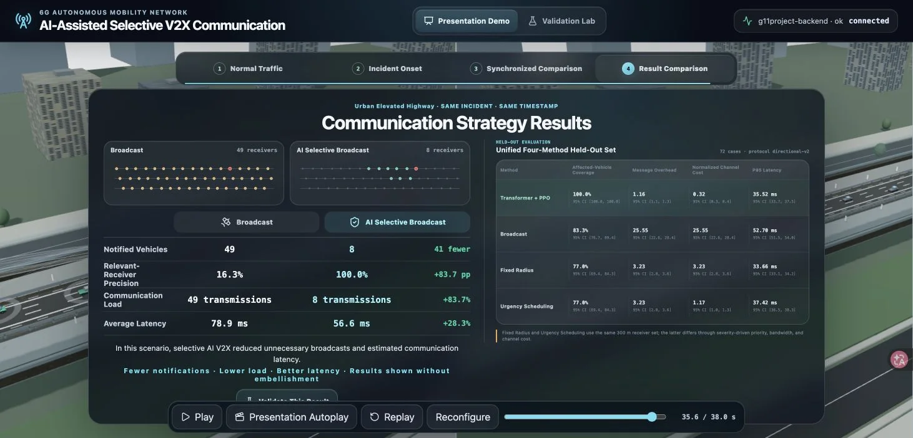
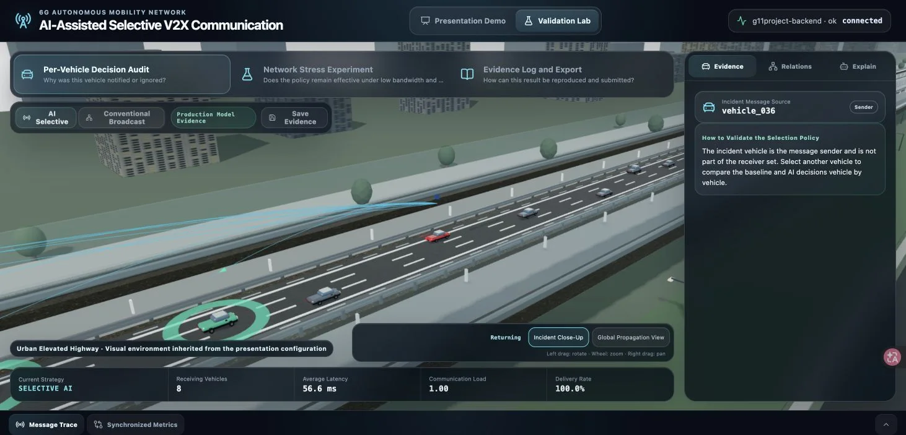

# Transformer-PPO Selective V2X Communication for 6G Autonomous Driving

**面向6G自动驾驶的 Transformer-PPO 选择性 V2X 通信调度**

[](https://github.com/yangyu-rgb/G11project/actions/workflows/ci.yml)
[](BackEnd/pyproject.toml)
[](FrontEnd/package.json)
[](https://sumo.dlr.de/)
[](LICENSE)
[](#limitations-and-scope)

An end-to-end research prototype for learning **who should receive an emergency V2X message,
with what priority, and with how much communication resource** under dynamic highway conditions.
The system combines SUMO traffic traces, a 3GPP-inspired network abstraction, Transformer state
encoding, PPO scheduling, a fail-closed model registry, and an interactive 3D evidence interface.

本项目研究动态高速场景中紧急消息的接收者、优先级和带宽联合决策，并提供从仿真、训练、验收到三维答辩演示的完整链路。

<p align="center">
  
</p>

## Abstract

Broadcasting safety messages to every connected vehicle is simple but can create unnecessary
traffic and contention. Fixed-radius filtering reduces the communication domain but does not model
directional risk or adapt resource allocation to context. This project encodes padded vehicle,
event, and network observations with a Transformer and uses Proximal Policy Optimization (PPO) to
select a physically valid rear-risk corridor. The learned action jointly controls corridor radius,
lane scope, priority, and bandwidth fraction. A synchronized evaluation pipeline compares the
policy with broadcast, distance, urgency, and fixed-directional baselines using isolated held-out
scenarios. A React/Three.js interface presents the same decision evidence as directional links,
vehicle states, live telemetry, and auditable per-vehicle explanations.

中文摘要：项目使用Transformer理解车辆—事件—网络关系，再由PPO输出方向风险走廊和通信资源，在保证风险车辆覆盖的同时减少无效传播。

## Research Questions

1. Can a learned policy preserve affected-vehicle coverage while reducing redundant V2X traffic?
2. Can receiver geometry, priority, and bandwidth be optimized as one structured action?
3. Does the learned policy adapt its action across unseen incident positions without notifying
   vehicles ahead of the incident?
4. Can every result shown in the demo be traced back to a synchronized state, model manifest, and
   held-out evaluation artifact?

研究问题聚焦覆盖率、通信效率、上下文自适应和结果可追溯性，而不是单纯追求视觉效果。

## Key Contributions

- **Structured Transformer-PPO policy.** Vehicle, event, mask, and network tensors are encoded by a
  Transformer feature extractor before PPO actor and critic heads.
- **Directional action space.** PPO selects rear-corridor radius, same-lane or adjacent-lane scope,
  three-level priority, and one of ten bandwidth fractions.
- **Auditable safety gate.** A champion is accepted only when schema, hash, held-out metrics,
  nearest-follower coverage, action diversity, and zero-forward-notification checks all pass.
- **Unified comparison protocol.** AI and deterministic baselines consume the same scenario,
  network seed, and timestamp, with undefined coverage cases excluded rather than converted to zero.
- **Evidence-oriented 3D interface.** The frontend exposes synchronized comparison, current resource
  actions, held-out results, and a frozen-frame validation laboratory.

核心贡献是将风险关系理解、方向接收范围和无线资源调度统一为可训练、可审计、可演示的端到端系统。

## System Overview

<p align="center">
  
</p>

```text
SUMO scenarios and traces
        │
        ▼
Gymnasium V2X environment ──► vehicle/event/network observations
        │
        ▼
Transformer encoder ──► global and per-vehicle embeddings
        │
        ▼
PPO policy ──► radius, lane scope, priority, bandwidth
        │
        ▼
Network model + reward + held-out evaluation
        │
        ▼
FastAPI/WebSocket ──► synchronized React/Three.js evidence interface
```

系统严格区分训练、离线评价和现场推理：演示只加载已训练模型，不在播放期间更新策略。

## Method

### Observation and Transformer encoding

At time $t$, the environment produces padded observations

\[
o_t = \{V_t, M^V_t, E_t, M^E_t, N_t\},
\]

where $V_t$ and $E_t$ are vehicle and event feature tensors, $M^V_t$ and $M^E_t$
are validity masks, and $N_t$ represents available bandwidth and network load. Separate feature
projections are followed by masked self-attention:

\[
H_t = \operatorname{Transformer}([\phi_v(V_t);\phi_e(E_t)]).
\]

### PPO structured action

The presentation champion uses the four-dimensional action

\[
a_t=(r_t,\ell_t,p_t,b_t),
\]

with corridor radius $r_t\in\{75,150,225,300,375\}$ metres, lane scope
$\ell_t\in\{\text{same},\text{same+adjacent}\}$, priority $p_t\in\{0,1,2\}$,
and bandwidth fraction $b_t\in\{0.1,\ldots,1.0\}$. Receiver identities are derived from this
action and relative road geometry; vehicles ahead, moving in the opposite direction, or outside the
selected corridor are not legal receivers.

PPO optimizes the clipped objective

\[
L^{\mathrm{CLIP}}(\theta)=
\mathbb{E}_t\left[\min\left(
\rho_t(\theta)\hat A_t,
\operatorname{clip}(\rho_t(\theta),1-\epsilon,1+\epsilon)\hat A_t
\right)\right].
\]

### Multi-objective reward

The full reward combines effective delivery and affected-vehicle coverage with latency,
communication overhead, missed receivers, resource use, safety violations, and fairness penalties:

\[
R_t=w_dD_t+w_cC_t-w_lL_t-w_oO_t-w_mM_t-w_rB_t-w_sS_t-w_fF_t.
\]

Exact weights are configuration-controlled and are reported with each experiment rather than
embedded in the interface. See the [technical specification](Docs/TECHNICAL_SPECIFICATION.md).

方法核心不是“只给后车发消息”的固定规则，而是让PPO在合法方向约束中学习走廊尺度、车道范围、优先级和带宽组合。

## Baselines and Evaluation

| Method | Receiver rule | Resource rule | Used in live UI |
|---|---|---|---|
| Broadcast | All non-sender vehicles | Fixed high priority, full bandwidth | Yes |
| Distance | All vehicles within 300 m | Fixed high priority, full bandwidth | Yes |
| Urgency | Same 300 m receiver set | Severity-driven priority and bandwidth | Yes |
| Fixed directional corridor | Fixed 300 m rear corridor | Fixed high priority, 50% bandwidth | Offline evaluation |
| Transformer + PPO | Learned rear corridor and lane scope | Learned priority and bandwidth | Yes |

The principal metrics are affected-vehicle coverage, selection coverage, effective delivery,
P50/P95/P99 latency, timeout rate, message overhead, normalized channel cost, and timely-event rate.

固定范围与紧急度在当前基线定义中共享接收集合，区别体现在优先级、带宽和信道成本；固定方向走廊用于离线参考。

## Preliminary Held-out Results

The current accepted artifact uses protocol `directional-v2`, metric schema v2, 72 independent
highway incident configurations, and five methods, producing 360 result rows. Sixty cases contain
at least one affected vehicle and are eligible for coverage aggregation; zero-affected cases remain
in the test matrix but are excluded from undefined coverage means.

Evidence status: **preliminary highway-only course-demo evidence**.

| Method | Affected coverage | P95 latency | Msg. overhead | Channel cost |
|---|---:|---:|---:|---:|
| **Transformer + PPO** | **1.000** (n=60) | 35.52 ms (n=61) | 1.161 (n=60) | **0.321** (n=60) |
| Broadcast | 0.833 (n=60) | 52.70 ms (n=72) | 25.552 (n=58) | 25.552 (n=58) |
| Distance | 0.770 (n=60) | 33.66 ms (n=70) | 3.226 (n=56) | 3.226 (n=56) |
| Urgency | 0.770 (n=60) | 37.42 ms (n=70) | 3.226 (n=56) | 1.173 (n=56) |
| Fixed corridor | 0.929 (n=60) | **30.94 ms** (n=60) | **1.017** (n=59) | 0.508 (n=59) |

<p align="center">
  
</p>

The champion manifest records 100% nearest-follower coverage across six opportunities, ten receiver
signatures across twelve unique test incidents, four structured-action signatures, and zero
notifications to vehicles ahead. These values describe this locked simulated test protocol; they do
not establish real-road performance.

初步结果仅适用于当前高速单事故、SUMO交通分布和网络抽象模型；城市、多事件、真实信道与车规硬件仍属于后续验证。

## Demo Gallery

| Guided configuration | Synchronized comparison |
|---|---|
|  |  |

| Held-out summary | Validation laboratory |
|---|---|
|  |  |

The 38-second presentation contains four stages: normal traffic, incident onset, synchronized
algorithm comparison, and result summary. Camera control remains available during comparison.
The runtime UI is fully English. Open-road, elevated-city, and tunnel presets share the same
simulation state while changing only PBR materials, lighting, roadside geometry, and tone mapping;
clear-day, overcast-haze, and golden-hour atmosphere profiles are also presentation-only. Auto,
Presentation, and Balanced render modes control pixel density and shadow resolution without changing
the evidence frame. Directional links encode actual delivery status, priority, latency, and bandwidth:
AI paths are cyan/green, baseline paths are amber, timeouts are red, moving packet density reflects
the current bandwidth action, and acknowledgements appear as receiver rings. Evidence layers can be
expanded only when needed so the synchronized road views remain readable.

演示不是预渲染视频：事故车、对照方法和场景可在入口配置，结果来自同步后端推理与基线计算。

## Quick Start

### Requirements

- Python 3.12 recommended; package metadata supports Python 3.11+
- Node.js 22
- Eclipse SUMO 1.27.x with `sumo`, `netgenerate`, `traci`, and `sumolib`

### Start the application

macOS / Linux:

```bash
git clone https://github.com/yangyu-rgb/G11project.git
cd G11project
./start.sh
```

Windows 10/11 (CMD or double-click):

```bat
git clone https://github.com/yangyu-rgb/G11project.git
cd G11project
start.cmd
```

Windows PowerShell users may run the native launcher directly:

```powershell
git clone https://github.com/yangyu-rgb/G11project.git
Set-Location G11project
powershell -ExecutionPolicy Bypass -File .\start.ps1
```

The Windows launcher automatically uses `BackEnd\.venv\Scripts\python.exe`, runs `npm ci` on
the first launch, creates the Python virtual environment when needed, and stops both child process
trees when the launcher exits. Install 64-bit Python 3.11/3.12 and Node.js 22 LTS before the first
run. `start.sh` remains the launcher for Bash-based systems and WSL.

The script creates `BackEnd/.venv`, installs missing frontend packages, and starts:

- Frontend: <http://localhost:5173>
- Backend: <http://localhost:8000>
- OpenAPI: <http://localhost:8000/docs>
- Health check: <http://localhost:8000/api/v1/health>

Model checkpoints and runtime experiment directories are intentionally ignored by Git. Without an
eligible directional-v2 champion, the frontend remains usable for inspection but the formal AI demo
fails closed. Follow [Reproducibility](Docs/REPRODUCIBILITY.md) to train and promote a champion.

克隆仓库后可直接启动开发环境；正式AI按钮只有在模型、清单、哈希和验收门禁全部一致时才会启用。

### Local smoke assets

```bash
cd BackEnd
.venv/bin/python scripts/generate_highway_scenario.py --output experiments/test_scenario
.venv/bin/python src/training/train_ppo.py \
  --config configs/training_config.yaml \
  --episodes 10 \
  --output experiments/test_ppo
```

These smoke assets verify the pipeline; they are not the accepted presentation champion.

### Verify SUMO

```bash
BackEnd/.venv/bin/python BackEnd/scripts/verify_sumo.py
```

## Training and Reproduction

- Formal multi-stage research pipeline:
  [`colab_formal_training.ipynb`](BackEnd/notebooks/colab_formal_training.ipynb)
- Lightweight course-demo pipeline:
  [`colab_demo_lite_training.ipynb`](BackEnd/notebooks/colab_demo_lite_training.ipynb)
- Accepted directional corridor v2 pipeline:
  [`colab_directional_corridor_v2.ipynb`](BackEnd/notebooks/colab_directional_corridor_v2.ipynb)
- Model eligibility and promotion:
  [`MODEL_TRAINING_ACCEPTANCE.md`](BackEnd/MODEL_TRAINING_ACCEPTANCE.md)
- Full commands and artifact lineage:
  [`REPRODUCIBILITY.md`](Docs/REPRODUCIBILITY.md)

正式结果必须携带配置、随机种子、代码提交、模型哈希、协议版本和原始汇总文件。

## Repository Structure

```text
G11project/
├── FrontEnd/                 React, TypeScript, Three.js, synchronized evidence UI
├── BackEnd/
│   ├── app/                  FastAPI, WebSocket sessions, model registry
│   ├── src/
│   │   ├── models/           Transformer, Graph Transformer, PPO integration
│   │   ├── environment/      Gymnasium, receiver relevance, network and reward models
│   │   ├── evaluation/       Deterministic baselines and metrics
│   │   ├── experiments/      Splits, statistics, gates, artifact I/O
│   │   └── training/         PPO training entry point
│   ├── configs/              Scenario, training, comparison, ablation configurations
│   ├── notebooks/            Colab entry points
│   └── scripts/              Scenario, training, evaluation and promotion pipelines
├── Test/                     Unit, integration, frontend and end-to-end tests
├── Docs/                     Research, reproduction, demo and workflow documentation
├── ARCHITECTURE.md           Implemented architecture and data contracts
├── CONTRIBUTING.md           Research-aware contribution rules
├── CITATION.cff              Software citation metadata
└── LICENSE                   MIT License
```

代码目录保持现有前后端边界，科研文档和证据素材集中在 `Docs/` 中维护。

## Quality Assurance

```bash
cd FrontEnd
npm run lint
npm test
npm run build

cd ../BackEnd
.venv/bin/python -m ruff check . ../Test
.venv/bin/python -m ruff format --check . ../Test
.venv/bin/python -m pytest
```

GitHub Actions runs frontend, backend, and project checks on pushes, pull requests, merge queues,
and manual dispatches.

自动测试覆盖模型环境、基线、网络模型、实验流水线、WebSocket、动画引擎、几何关系和证据一致性。

## Documentation

- [Documentation index](Docs/README.md)
- [System architecture](ARCHITECTURE.md)
- [Technical specification](Docs/TECHNICAL_SPECIFICATION.md)
- [Experiment protocol and results](Docs/EXPERIMENTS.md)
- [Reproducibility guide](Docs/REPRODUCIBILITY.md)
- [Presentation and demo guide](Docs/DEMO_GUIDE.md)
- [Implementation roadmap](Docs/IMPLEMENTATION_ROADMAP.md)

## Limitations and Scope

- The accepted evidence currently covers simulated single-incident highway scenarios only.
- SUMO behavior and the network abstraction do not replace real-road or hardware-in-the-loop tests.
- The 3GPP mode is an analytical abstraction, not a full protocol-stack or ns-3 simulation.
- Urban, multi-event, ablation, and cross-domain formal conclusions remain future work.
- Attention is exposed for diagnosis and presentation but is not claimed as causal explanation.
- The software is a research and course-demonstration prototype, not a safety-certified product.

项目当前定位是可复现的科研概念验证，不代表真实道路部署效果，也不具备车规安全认证。

## Citation

Use the repository's [`CITATION.cff`](CITATION.cff) metadata. No DOI has been assigned.

```text
Yang Yu. Transformer-PPO Selective V2X Communication for 6G Autonomous Driving.
Version 0.1.0, 2026. https://github.com/yangyu-rgb/G11project
```

## Contributing and License

Contributions are welcome under the requirements in [CONTRIBUTING.md](CONTRIBUTING.md).
The software is released under the [MIT License](LICENSE).

贡献代码或实验结果前，请确保所有数字可追溯且不会把规则降级输出标记为AI推理。
